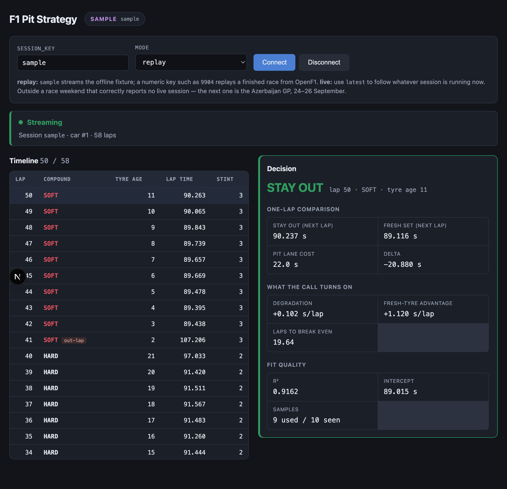

# F1 Pit Strategy

A live pit-stop decision tool for Formula 1. It answers one question,
continuously, **while a race is happening**: pit now, or stay out?



---

## The problem

During a race a strategist answers the same question over and over, under time
pressure, with incomplete information: **pit now, or stay out?**

Tyres degrade. Lap times get slower every lap on a given set. Fresh tyres are
faster — but a pit stop costs about 22 seconds, and you only get that back if
you run long enough on the new set to earn it. The right call depends on how
worn the current tyres are, how much faster a fresh set would be, and how many
laps remain to recover the stop.

That is arithmetic, done under pressure, on data arriving three seconds at a
time. This tool does the arithmetic continuously and **shows every number
behind the answer**, so it can be argued with rather than trusted blindly.

## Why live, and not retrospective analysis

Analysing a finished race is a different and much easier problem: you can see
the whole race, including the laps that hadn't happened yet at the moment the
decision had to be made. A strategist cannot.

So the constraint that shapes this entire codebase is: **every number is
computed from data seen so far, never from the full race in hindsight.** The
decision engine only ever sees "the next tick". It cannot look ahead, because
during a live race there is nothing ahead to look at.

That constraint is also what makes replay mode honest. Replaying a finished
race through the same pipeline produces exactly what you would have seen
live — not a retrospective analysis wearing a live costume.

---

## Try it

| | |
|---|---|
| **Dashboard** | _deployed URL goes here_ |
| **Backend health** | _deployed URL_`/health` |

Pick **replay** + `sample` for the offline fixture, **replay** + `9904` for the
2025 Azerbaijan GP, or **live** + `latest` for whatever is running now.

> **Note on the demo:** the screenshots and demo clip show **replay mode**,
> labelled as such in the UI by the `SAMPLE` / `REPLAY` badge. They are not a
> live session. Live mode shows a `LIVE` badge, and only when the server has
> confirmed a session is actually running.

> **Render free tier spins down after 15 minutes idle**, with a 30–60 second
> cold start. Before a session during the race weekend, hit `/health` a few
> minutes early to wake it. Otherwise the first connection of a live session
> will look broken for a minute — the worst possible time for that.

---

## Three decisions worth explaining

### 1. `TickSource`: an interface built on Day 1 with only one implementation

Day 1 had no live mode and no way to build one — the race weekend was three
weeks away. The obvious move was "fetch a historical race, replay it", and add
live later.

Instead the streaming layer was written against an interface, `TickSource`,
with a single implementation behind it. That looks like over-engineering, and
usually is. Here it wasn't, because live and replay differ in *shape*, not
just in data source: replay knows the whole race up front and fakes the
waiting; live doesn't know when the race ends and does real waiting. Code
written against replay's shape silently assumes things only replay
guarantees — that `total_laps` exists, that the data is already in memory,
that iteration can't fail halfway.

The interface forced the WebSocket handler to be written against the weaker
set of guarantees from the start.

**What it cost:** an abstraction with one implementation for three days.
**What it bought:** adding live mode on Day 4 changed *one function* —
`_build_source` gained a single branch. The decision engine, the message
protocol, and the entire frontend were untouched. A contract test now runs
both implementations over the same data and asserts their output is equal
field by field, so they cannot drift.

### 2. The null-duration catch

The bug that would have quietly ruined live mode.

A lap appears in OpenF1's `/v1/laps` the moment a car **starts** it, with
`lap_duration: null` until it finishes. The polling loop's job is to emit each
lap exactly once and never re-send it.

Those two facts combine badly. Emit a lap as soon as it appears and you send a
tick whose lap time is permanently `null` — because under the no-duplicates
rule it will never be sent again. The degradation curve would then lose a data
point on **every single lap of the race**, and the fit would be built from
nothing but the laps that happened to be slow enough to still be pending.

Nothing would crash. The dashboard would show a verdict. The verdict would be
garbage.

The fix: hold back the newest lap while it has no lap time, and release it
once either a duration arrives or a higher lap number proves it is over and
the missing duration is real absence rather than pending data.

This is a live-only failure mode. Replay never hits it — every lap already has
its final duration. It was found by reasoning about what the API does during a
session, not by a test failing.

### 3. Reporting negative degradation instead of hiding it

Fitting lap time against tyre age on the real 2025 Azerbaijan GP gives a slope
of **−0.066 s/lap**. The tyre appears to get *faster* as it wears.

That is not a bug. A car sheds roughly 100kg of fuel over a stint, worth about
−0.03 s/lap, and on a hard tyre at Baku that cancels degradation outright. The
model measures (degradation − fuel effect), and this project does not correct
for fuel.

There were two options. Clamp the slope to zero and always show a plausible
number — or report it. The tool reports it: `degradation_is_measurable: false`,
no break-even figure, and a note explaining that fuel burn can mask tyre wear.

A tool that always produces a confident number is indistinguishable from one
that produces a correct number, right up until someone acts on it. This one
says "I can't tell" when it can't tell.

(Getting there took two other corrections, both caught by hand-checking rather
than by tests passing: an outlier filter that discarded every genuinely
degraded lap on a fast-wearing tyre, and a contaminated-data rule that let a
safety-car lap invert the fitted slope.)

---

## Why Docker

Reproducibility, and nothing more.

Render can deploy this from its own Python buildpack. The buildpack detects
`pyproject.toml`, resolves dependencies itself, and guesses a start command —
none of which this repo controls or can reproduce locally. When something
behaves differently in production, there is no local equivalent to compare
against.

The Dockerfile installs dependencies with `uv sync --frozen` against the
committed `uv.lock`, so the container gets the exact versions tested all week
rather than whatever resolves at build time. The image that runs on Render is
the image that ran here — and that claim was checked, not assumed: the full
message stream from the container was diffed against the same stream from a
local `uvicorn`, and all 109 messages were identical.

That's the whole reason. It is not here to demonstrate that Docker was used.

---

## Running it locally

**Backend** (Python 3.11, [uv](https://docs.astral.sh/uv/)):

```bash
cd backend
uv sync
uv run uvicorn backend.main:app --reload     # http://127.0.0.1:8000
uv run pytest                                # 71 tests, no network, ~0.1s
```

**Or the container**, which is what production runs:

```bash
cd backend
docker build -t f1-pit-strategy-backend .
docker run --rm -p 8000:8000 \
  -e PORT=8000 \
  -e F1_ALLOWED_ORIGINS=http://localhost:3000 \
  f1-pit-strategy-backend
```

**Frontend** (Node, pnpm):

```bash
cd frontend
pnpm install
pnpm dev                                     # http://localhost:3000
```

Without a browser, `backend/scripts/ws_client.py` prints the raw stream:

```bash
uv run python scripts/ws_client.py --tick-interval 0.05
uv run python scripts/ws_client.py --session-key 9904 --driver-number 1
uv run python scripts/ws_client.py --session-key latest --mode live
```

---

## Configuration

Nothing is baked into the image. Everything is read from the environment at
startup, so the same image runs locally, in CI and on Render.

**Backend** (prefix `F1_`):

| Variable | Default | Purpose |
|---|---|---|
| `PORT` | `8000` | Port to bind. Render sets this. |
| `F1_ALLOWED_ORIGINS` | *(empty = allow all)* | Comma-separated browser origins. **Set this in production.** |
| `F1_OPENF1_BASE_URL` | `https://api.openf1.org/v1` | OpenF1 API root. |
| `F1_REPLAY_TICK_INTERVAL_SECONDS` | `0.5` | Replay pacing. |
| `F1_PIT_LANE_COST_SECONDS` | `22.0` | Pit-lane time loss. |
| `F1_LIVE_POLL_INTERVAL_SECONDS` | `10.0` | Live poll interval. |

`/health` echoes the effective configuration, including `allowed_origins`, so a
misconfiguration is visible from a `curl` rather than discovered as a frontend
that cannot connect.

**Frontend:**

| Variable | Purpose |
|---|---|
| `NEXT_PUBLIC_BACKEND_WS_URL` | Backend URL. Accepts `https://…`, `http://…`, `wss://…`, `ws://…` or a bare host — the scheme is normalised. |

An `https://` value becomes `wss://` automatically. This matters: a page served
over HTTPS **cannot** open a plain `ws://` connection — browsers block it as
mixed content, with no callback and only a console error. Unset in production,
the app says so explicitly rather than silently trying `localhost`.

---

## Deploying

**Backend → Render** (free, no credit card):

1. **New → Blueprint**, point it at this repo. `render.yaml` selects
   `runtime: docker` with `backend/Dockerfile` — not the Python buildpack.
2. Set `F1_ALLOWED_ORIGINS` to the Vercel URL once the frontend is deployed.
3. Check `https://<service>.onrender.com/health`.

**Frontend → Vercel** (free):

1. Import the repo, set **Root Directory** to `frontend`.
2. Set `NEXT_PUBLIC_BACKEND_WS_URL` to the Render URL (`https://…` is fine).
3. Deploy, then put the Vercel URL into Render's `F1_ALLOWED_ORIGINS` and
   redeploy the backend.

---

## Architecture

```
        TickSource (interface)
        ├── ReplayTickSource   a finished race or the offline fixture, paced
        └── LiveTickSource     polls OpenF1 during a live session
                    │
                    ▼             both produce identical TickMessages
            decision_engine       one engine; it cannot tell them apart
                    │
                    ▼
        FastAPI   WS /ws/race/{session_key}?mode=replay|live
                    │
                    ▼
            Next.js dashboard     shows which mode is active, always
```

Message protocol: `start` → (`tick` → `decision`)* → `end`, or `error`, or
`no_live_session`.

`no_live_session` is a message type of its own rather than an error, because
live mode spends most of the year with nothing to connect to. Rendering that
as a failure would train you to ignore the component meant to tell you when
something is genuinely broken.

---

## What has been verified, and what has not

**Live mode has never run against a live session**, because there hasn't been
one since it was built. The first real test is Azerbaijan practice on
**24 September 2026**.

**Verified:**

| | How |
|---|---|
| Live-session detection, both 30-minute window edges | 24 tests against real OpenF1 session metadata with a mocked clock, at one-second resolution |
| Rate-limit compliance (~3 req/s, 30 req/min) | Virtual-clock tests; measured 12 req/min, 40% of the allowance |
| Backoff on 429 / transient failure, honest give-up | Tests with injected failures |
| Live and replay emit identical ticks | Contract test comparing both implementations field by field |
| Malformed / partial data degrades, never crashes | 14 tests: null durations, inverted ranges, absurd lap counts, non-JSON, 404, 429, 500, timeouts |
| Container matches local behaviour | Full message stream diffed: 109 messages identical |
| Replay end to end | 58-lap fixture and a real historical race, in a browser, through the container |
| Reconnect with backoff | Backend killed mid-stream: 1s→2s→4s, recovery, honest failure after 6 attempts |

**Not verified, and cannot be until the race weekend:**

- That a live session is detected as live **by the real clock**
- That polling receives **genuinely new laps as they happen**
- That OpenF1's live data has the shape its historical data has
- That the rate limit holds across a full session under real load

The polling logic runs against a fake client whose data grows between polls.
That proves the logic; it does not prove OpenF1 behaves that way live.

---

## Stated simplifications

Deliberate, not oversights:

- **This answers "is it faster to pit", never "will pitting cost me a
  position."** Track position is a multi-driver question and is out of scope
  for the whole project.
- **Pit-lane cost is one constant (22s).** Circuit-dependent in reality; not
  researched per circuit.
- **Degradation is fitted as a straight line.** Real tyres have a cliff a line
  under-predicts.
- **No fuel-burn correction** — see decision 3 above.
- **Replay pacing is not real lap timing.** A fixed interval, for usability.
- **One driver at a time.**

---

## What's next

1. **The real test**: point the deployed app at Azerbaijan practice on
   24 September and find out whether live mode works. If it fails, that is the
   final task of this project, not a footnote.
2. Fuel-burn correction, so degradation on real data stops reading negative.
3. Multi-lap lookahead — the current one-lap comparison is why `verdict` reads
   `stay_out` almost always and `laps_to_break_even` is the number to read.
4. Multi-driver, and with it the undercut/overcut question this deliberately
   does not answer.

---

## Data source

[OpenF1](https://openf1.org) — free, no API key. Historical data from 2023;
live data from 30 minutes before a session starts to 30 minutes after it ends.

One quirk: a query matching nothing returns `404 {"detail": "No results
found."}` rather than `200 []`. That is an empty result, not a rejected
request, and the client normalises it.
