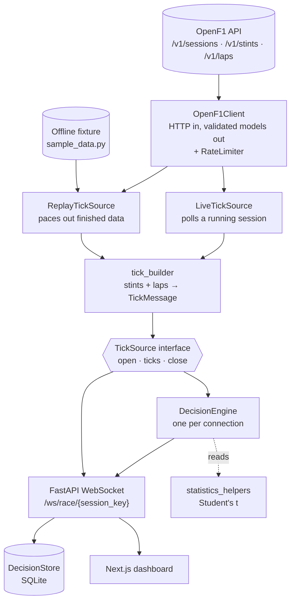
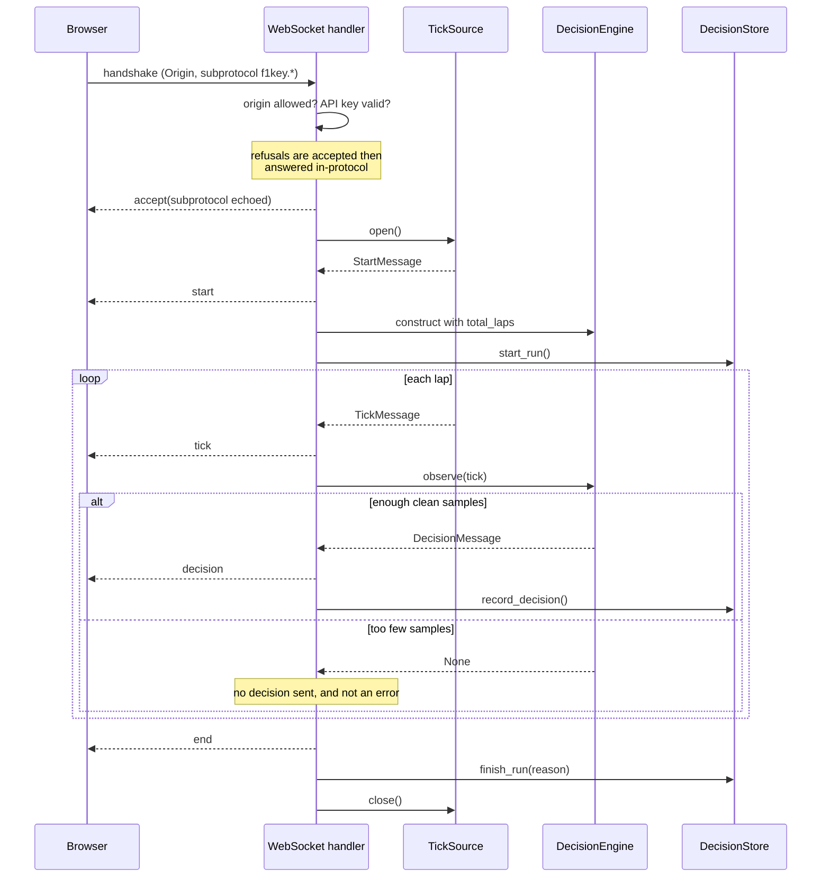
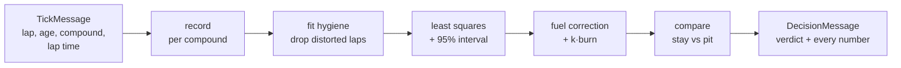
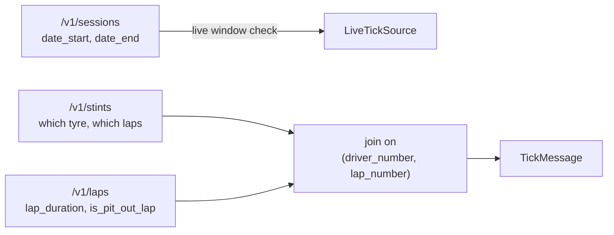
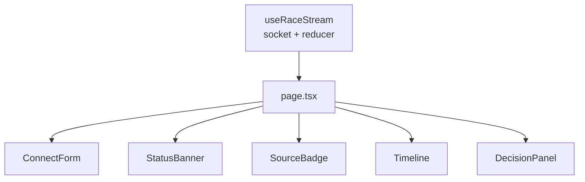
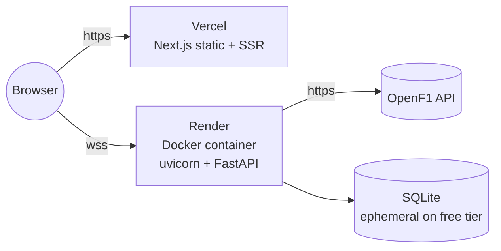

# Architecture

How the system is put together and why. For the API surface see
[API.md](API.md); for the reasoning behind specific numbers and the validation
work see [ENGINEERING.md](ENGINEERING.md).

## Contents

- [What the system does](#what-the-system-does)
- [The constraint that shapes everything](#the-constraint-that-shapes-everything)
- [Component map](#component-map)
- [The `TickSource` seam](#the-ticksource-seam)
- [Lifecycle of a connection](#lifecycle-of-a-connection)
- [The decision pipeline](#the-decision-pipeline)
- [Concurrency model](#concurrency-model)
- [Failure model](#failure-model)
- [Data flow from OpenF1](#data-flow-from-openf1)
- [Frontend architecture](#frontend-architecture)
- [Storage](#storage)
- [Deployment topology](#deployment-topology)
- [Module map](#module-map)
- [Testing strategy](#testing-strategy)

---

## What the system does

It answers one question, continuously, while a race is happening: **pit now, or
stay out?**

Tyres degrade — lap times get slower every lap on a given set — but a pit stop
costs about 22 seconds, and that is only repaid by running long enough on the
new set to earn it back. The system streams a race lap by lap, fits a
degradation curve as the laps arrive, and emits a verdict with every number
behind it.

Two modes, one pipeline:

| mode | source | used for |
|---|---|---|
| `live` | polls OpenF1 during a running session | the actual product |
| `replay` | a finished race, or an offline fixture, paced out | development, testing, demos |

Both modes share the same decision engine and the same message protocol. Only
the data source differs.

---

## The constraint that shapes everything

**Every number is computed from data seen so far, never from the full race in
hindsight.**

Analysing a finished race is a different and much easier problem: you can see
the laps that had not happened yet at the moment the decision had to be made. A
strategist cannot. So the decision engine only ever sees "the next tick" — it
has no method that takes a whole race, and no access to one.

Two consequences fall out of this:

1. **Replay is honest.** Replaying a finished race through the same pipeline
   produces exactly what you would have seen live, not a retrospective analysis
   wearing a live costume.
2. **The engine is reusable unmodified in live mode.** Something that cannot
   look ahead does not need to change when there is nothing ahead to look at.

The backtest enforces this with a test that alters the end of a race and
asserts earlier predictions do not move — verified to fail when a future-data
leak is deliberately introduced.

---

## Component map



Everything below `TickSource` is mode-agnostic. `_build_source` in `main.py` is
the only function in the request path that knows which mode is in play; it is a
single branch.

---

## The `TickSource` seam

The interface is three methods:

```python
async def open() -> StartMessage      # fallible setup; describe the stream
def ticks() -> AsyncIterator[Tick]    # yield ticks as they become available
async def close() -> None             # release what open() acquired
```

### Why `open()` is separate from `ticks()`

Both implementations do fallible I/O before the first tick exists — replay
fetches and flattens a race, live checks whether a session is running at all.
That work produces the `start` message's metadata (`total_laps` is unknowable
until the data is in hand) and fails in ways the client needs told about
precisely.

Splitting it gives the handler a clean shape:

```python
start = await source.open()        # may raise → send `error`
await send(start)                  # worked → send `start`
async for tick in source.ticks():  # → send each `tick`
```

Fused into one generator, the handler would have to pull the first item before
knowing the stream was viable, and "couldn't start" would blur into "started,
then died".

### Why an async iterator rather than a callback

- **async** — producing the next tick means waiting (a timer in replay, an HTTP
  poll in live). `await` releases the event loop so other connections are
  served meanwhile. A synchronous generator calling `time.sleep()` would freeze
  every client on the server.
- **iterator** — the consumer *pulls*. The source is suspended at `yield` until
  asked for the next tick, so it cannot run ahead of a slow client. That is
  backpressure for free; a push design would need an explicit queue and a
  policy for what to do when it fills.

### What it cost and what it bought

The interface existed for three days with one implementation behind it —
normally over-engineering. It was justified here because live and replay differ
in *shape*, not just data source: replay knows the whole race up front and
fakes the waiting; live does not know when the race ends and does real waiting.
Code written against replay's shape silently assumes things only replay
guarantees.

Adding live mode changed **one function**. The decision engine, the message
protocol and the entire frontend were untouched. A contract test runs both
implementations over the same data and asserts their output is equal field by
field, so they cannot drift.

### One shared tick builder

Both sources construct `TickMessage` through `tick_builder.flatten_to_ticks`.
Two separate implementations could satisfy "identical shape" on the day they
were written and drift the first time either was touched; one function cannot.

---

## Lifecycle of a connection



### Why the socket is accepted before anything is validated

A rejected handshake gives the browser an opaque failure — `onerror` fires with
nothing useful in it. Accepting first means a real `error` envelope can explain
exactly what is wrong before closing. **Errors are part of the protocol, not
the absence of it.**

The same reasoning applies to the subprotocol echo: a browser that offered one
closes the connection unless the server names it back, so it is echoed on
refusals too. A rejection the client cannot read is indistinguishable from a
crash.

---

## The decision pipeline

### The model

Lap time is fitted as a straight line in tyre age, per compound:

```
lap_time(age) = b + m · age
```

For a set of age `A`, comparing the next lap:

```
stay out:  b + m·(A + 1)
pit now:   b + m·1 + pit_cost
delta   :  m·A − pit_cost
```

Extending over N laps, every `b` and every `m·N(N+1)/2` cancels, leaving
`m·N·A − pit_cost`. So the per-lap advantage of a fresh set is **`m · A`** —
slope times *current* tyre age, constant on every future lap — and:

```
laps_to_break_even = pit_cost / (m · A)
```

Not `pit_cost / m`, which would overstate the pit window by a factor of the
tyre's age. The one-lap `verdict` reads `stay_out` almost always;
`laps_to_break_even` is the number to act on.

### Stages



**Fit hygiene** drops laps distorted by things the model does not claim to
explain, using two monotonicity rules: a lap is excluded if it is much slower
than the best lap at a *similar* tyre age, or much slower than the best lap on
an *older* tyre. They are complements — the first fails when a whole
neighbourhood is contaminated, the second cannot catch contamination at a
stint's end. Both were found by hand-checking, not by tests passing.

**Fuel correction** removes a known bias. Within a stint, lap number and tyre
age are perfectly collinear, so regression can never separate fuel load from
tyre wear; the fuel term comes from a physical prior instead. The correction
cancels out of the stay-versus-pit comparison (both options run the same lap
with the same fuel), so it affects the verdict only through the corrected
slope.

**The confidence interval** separates "this tyre is not slowing" from "we
cannot yet tell", which a point estimate cannot. Three reported states:
`positive`, `unclear`, `negative`.

Numbers, derivations and the validation results are in
[ENGINEERING.md](ENGINEERING.md).

### Why the engine cannot tell which mode it is in

`TickMessage` carries no mode field. Mode is stated once, in `start`. If it
were on every tick, someone would eventually write `if tick.source == "live"`
inside the engine and the two modes would silently diverge.

---

## Concurrency model

Single-threaded asyncio, with two deliberate exceptions.

| concern | how |
|---|---|
| many simultaneous streams | one coroutine per connection; `await asyncio.sleep` for pacing, never `time.sleep` |
| per-connection state | one `DecisionEngine` per socket, constructed in the handler; a new connection cannot inherit history |
| OpenF1 requests | one pooled `httpx.AsyncClient` for the process, created in the lifespan |
| rate limiting | one `RateLimiter` shared across endpoints, guarded by an `asyncio.Lock` |
| SQLite writes | `asyncio.to_thread` behind a lock — `sqlite3` is synchronous and would stall every client |

The lock on the rate limiter is load-bearing: without it two coroutines could
both read the same "last request" timestamp, both decide no wait is needed, and
fire simultaneously — breaching the limit precisely when load is high.

The decision to run SQLite in a worker thread is the same judgement from the
other direction. On a server whose whole job is streaming, a synchronous write
on the event loop is the one thing it must not do.

---

## Failure model

The system distinguishes four kinds of bad news, and treats them differently.

| kind | example | behaviour |
|---|---|---|
| **not an error at all** | no live session right now; fewer than 3 clean samples | dedicated message type or silence; never styled as failure |
| **expected, explainable** | bad session_key, disallowed origin, missing API key, OpenF1 unreachable | `error` envelope with a machine-readable `code`, then close |
| **degradable** | one malformed OpenF1 row, decision-engine bug, storage failure | skip the record / skip the decision / skip the log; stream continues |
| **unexpected** | anything else | full traceback server-side, generic non-leaky `error` to the client |

Three specific containment decisions:

- **`no_live_session` is its own message type, not an error.** Live mode spends
  most of the year with nothing to connect to. Rendering that as a red failure
  would train the user to ignore the component meant to tell them when
  something is genuinely broken.
- **A decision-engine exception degrades the stream to ticks-only** rather than
  ending it. The tick stream is still valid and the client is still entitled to
  it, but a silently decision-free stream is logged with a full traceback.
- **Storage failures are swallowed inside the store.** The log records a race;
  it is not part of serving one. A full or read-only disk degrades to "no log",
  and if the log cannot be opened at all the service starts anyway with
  `/runs` reporting `enabled: false`.

Malformed upstream data is dropped, never guessed. A stint with a null
`lap_end` is skipped and logged rather than defaulted, because an invented lap
count would feed fabricated laps into the degradation fit. A stint spanning an
implausible number of laps is also skipped — without that cap, one corrupt
`lap_end` of 100000 becomes an out-of-memory outage rather than a bad row.

---

## Data flow from OpenF1

Three endpoints, joined client-side.



Stints are *ranges* ("laps 19–40 on HARDs, starting at age 0"); ticks are
*points* ("lap 27, HARD, age 8"). Expanding ranges into points is where tyre
age is computed:

```
tyre_age = tyre_age_at_start + (lap − lap_start)
```

Not `lap − lap_start`. OpenF1 reports stints that begin on used sets — Baku
2025 car #1 stint 2 starts at age 4 — so the naive version is wrong on real
data while passing every test written against a naive fixture.

### Rate limiting

The free tier is roughly 3 req/s and 30 req/min, and OpenF1 advertises no
rate-limit headers, so there is nothing to react to — compliance is enforced
before the request leaves.

| guard | value | covers |
|---|---|---|
| minimum gap between any two requests | 0.4s (2.5 req/s) | the per-second ceiling |
| live poll interval | 10s → 2 requests → 12 req/min | the per-minute budget, at 40% of it |
| batch interval (backtest) | 2.5s | many races in sequence |

Both guards are needed: a two-request poll could breach 3 req/s while the
per-minute average still looked healthy.

### One API quirk worth knowing

A query matching nothing returns `404 {"detail": "No results found."}`, not
`200 []`. That is an empty result, not a rejected request, and the client
normalises it. Live mode hits this constantly — "no session matching that key"
has the same shape.

---

## Frontend architecture

One page. All stream state lives in a single `useRaceStream` hook and is passed
down as props — no context, no store library, because there is one consumer
tree and one source of truth.



### One reducer, and why it matters

`ticks` and `latestDecision` are fields of **one** state object, so no render
can observe a decision without the ticks preceding it — they are literally the
same value. Two separate `useState` atoms could not guarantee that as a
property of the design; it would merely happen to be true.

That invariant is checked, not assumed: the reducer counts any decision
arriving for a lap with no matching tick, and the page renders a red banner if
the count is ever non-zero. It has been verified across ~2000 sampled renders
of a full race, in the browser, including through a reconnect.

### Connection state

Seven states, each with distinct wording and colour, none of them blank:
`idle`, `connecting`, `reconnecting`, `streaming`, `ended`, `no_live_session`,
`error`.

`connecting` and `reconnecting` are deliberately different: one means nothing
has started, the other means we were streaming and lost it.

`connect()` is imperative, not a `useEffect`. Connecting is a user action, not
a render-driven side effect — keying an effect on `sessionKey` would reconnect
on every keystroke, and this also sidesteps React StrictMode's dev double-mount
opening two sockets.

Reconnect backoff doubles from 1s to a 15s cap over six attempts, and never
retries a clean `end`, a server `error` or `no_live_session` — those are final
answers. The flag driving that is set **imperatively**, not derived from render
state, because `onclose` can fire before React re-renders.

### The source badge shows what the server did

`start.source` is rendered literally (`sample` / `historical_replay` / `live`),
never what the connect form requested. Those are different facts, and a
dashboard that showed the request could claim you are watching a live race when
you are not.

---

## Storage

SQLite, one file, two tables.

```
runs      (id, session_key, source, driver_number, total_laps,
           started_at, ended_at, total_ticks, total_decisions, end_reason)
decisions (run_id, lap, recorded_at, verdict, compound, tyre_age, payload)
```

The full decision is stored as JSON in `payload`, alongside a handful of
indexed columns. `DecisionMessage` gained fields three times in one week; a
column per field would have meant a migration each time, and the log's job is
to reproduce what was actually sent.

**No storage interface, deliberately.** `TickSource` was written as an ABC with
one implementation because a second was known and dated. A second storage
backend is speculative, so this is a concrete class; an ABC added for symmetry
would be the over-engineering that case was not.

**Durability:** on a host with an ephemeral filesystem — Render's free tier,
most container platforms without a mounted volume — the file is lost on every
deploy and every spin-down. It persists *within* a session, not across them.

In the container the log lives at `/data/decisions.db`. `/app` is created by
`WORKDIR` and owned by root while the process runs as a non-root user, so the
default relative path was silently unwritable there — caught by running the
image rather than by a test, since it is a property of the image and not of the
code. Mounting a volume at `/data` is what makes the log durable.

---

## Deployment topology



### Why a Dockerfile rather than a buildpack

Render can deploy this from its Python buildpack, which detects
`pyproject.toml`, resolves dependencies itself and guesses a start command —
none of which the repo controls or can reproduce locally. The Dockerfile
installs with `uv sync --frozen` against the committed `uv.lock`, so the
container runs the versions that were tested. That claim was checked: the full
message stream from the container was diffed against the same stream from a
local `uvicorn`, and all 109 messages were identical.

Two details in the image that matter:

- **uv is pinned**, not `:latest` — otherwise two builds of the same commit
  could use different uv versions, which is the reproducibility problem the
  file exists to solve.
- **`CMD` execs**, so uvicorn becomes PID 1 and receives SIGTERM directly.
  Without it the shell holds PID 1, swallows the signal, and every deploy ends
  in a SIGKILL that severs open WebSocket streams rather than closing them.

### `wss://`, not `ws://`

A page served over HTTPS cannot open a plain `ws://` connection — browsers
block it as mixed content, with no callback and only a console error. The
frontend normalises whatever form the backend URL is given in, so an `https://`
value becomes `wss://` automatically.

### Operational note

Render's free tier spins down after 15 minutes idle with a 30–60 second cold
start. Hit `/health` a few minutes before a live session, or the first
connection of a race will look broken at the worst possible moment.

---

## Module map

### Backend

| module | lines | responsibility |
|---|---|---|
| `main.py` | 444 | FastAPI app, WebSocket handler, REST routes, CORS, lifespan |
| `decision_engine.py` | 379 | fit hygiene, regression, confidence interval, the verdict |
| `backtest.py` | 373 | scoring the engine against finished races |
| `live.py` | 310 | `LiveTickSource`, live-window arithmetic, poll loop |
| `storage.py` | 256 | `DecisionStore` — SQLite, async-wrapped |
| `openf1_client.py` | 236 | HTTP in, validated models out; `RateLimiter` |
| `models.py` | 207 | domain models and the wire protocol |
| `replay.py` | 193 | `ReplayTickSource` |
| `config.py` | 125 | settings, all overridable by `F1_*` env var |
| `sample_data.py` | 108 | offline fixture, with contamination and fuel burn |
| `tick_builder.py` | 91 | stints + laps → ticks; shared by both sources |
| `auth.py` | 66 | API key extraction and constant-time comparison |
| `tick_source.py` | 55 | the interface |
| `statistics_helpers.py` | 40 | Student's t critical values |

### Frontend

| module | lines | responsibility |
|---|---|---|
| `lib/useRaceStream.ts` | 449 | socket lifecycle, reducer, reconnect, URL scheme |
| `components/DecisionPanel.tsx` | 220 | the verdict and every number behind it |
| `components/StatusBanner.tsx` | 124 | one distinct state per connection status |
| `lib/types.ts` | 123 | the wire protocol, mirrored from `models.py` |
| `components/ConnectForm.tsx` | 69 | session key, mode selector |
| `components/Timeline.tsx` | 66 | ticks, newest first, never truncated |
| `app/page.tsx` | 65 | the single page |
| `components/SourceBadge.tsx` | 27 | what the server actually did |

### Scripts

| script | |
|---|---|
| `scripts/ws_client.py` | terminal WebSocket client; curl cannot speak WebSocket |
| `scripts/backtest.py` | score the engine against real races |
| `scripts/check_decisions.py` | the decision scenarios as a printed table |

---

## Testing strategy

149 tests, no network, ~0.2s.

| file | n | protects |
|---|---|---|
| `test_live_window.py` | 24 | both 30-minute window edges at one-second resolution, against real session metadata with a mocked clock |
| `test_auth.py` | 19 | key extraction from both channels, constant-time comparison, rotation |
| `test_backtest.py` | 17 | scoring maths, clean-lap classification, and causality |
| `test_confidence_bounds.py` | 16 | interval narrows with data, widens with noise, `unclear` on three samples |
| `test_malformed_data.py` | 14 | null durations, inverted ranges, absurd lap counts, non-JSON, 404, 429, 500, timeouts |
| `test_fuel_correction.py` | 13 | correction size, the cancellation property, fixture recovery |
| `test_decision_log.py` | 13 | round-trip, pruning with cascade, failure containment |
| `test_decision_engine.py` | 10 | the hand-computed scenarios |
| `test_live_polling.py` | 8 | no re-sending, in-progress hold-back, both termination paths |
| `test_rate_limit.py` | 8 | the poll loop never beats its interval |
| `test_tick_source_contract.py` | 7 | both implementations are interchangeable |

Three principles this suite follows:

**No network.** Every test runs against in-memory fakes, so the suite is
deterministic and does not fail because somebody else's API is down. The *data*
is real, though — session timings and stint shapes copied from actual OpenF1
responses.

**Time is injected, never waited for.** `RateLimiter`, `LiveTickSource` and the
backtest all take `clock` and `sleep` parameters. A test asserting real spacing
with real sleeps would take minutes, so it would end up skipped, so it would
stop protecting anything.

**Tests are checked for teeth.** Two tests in this suite were vacuous when
first written — a causality check whose alteration was discarded by the
engine's own outlier filter, and a storage test using `chmod` after the file
descriptor was already open. Both passed while proving nothing. Both were found
by deliberately introducing the bug the test claimed to catch, and both are now
verified to fail when it is present.

The hand-computed decision scenarios run with fuel correction **disabled**, via
a `raw_settings` fixture. They verify the regression and pit arithmetic against
values derived on paper; folding a constant shift into each would obscure what
they check. Fuel correction has its own tests.
